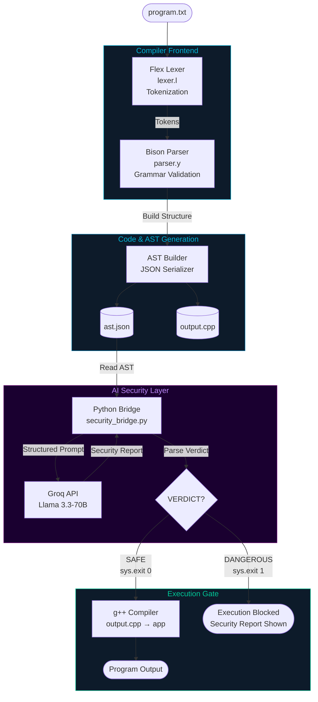
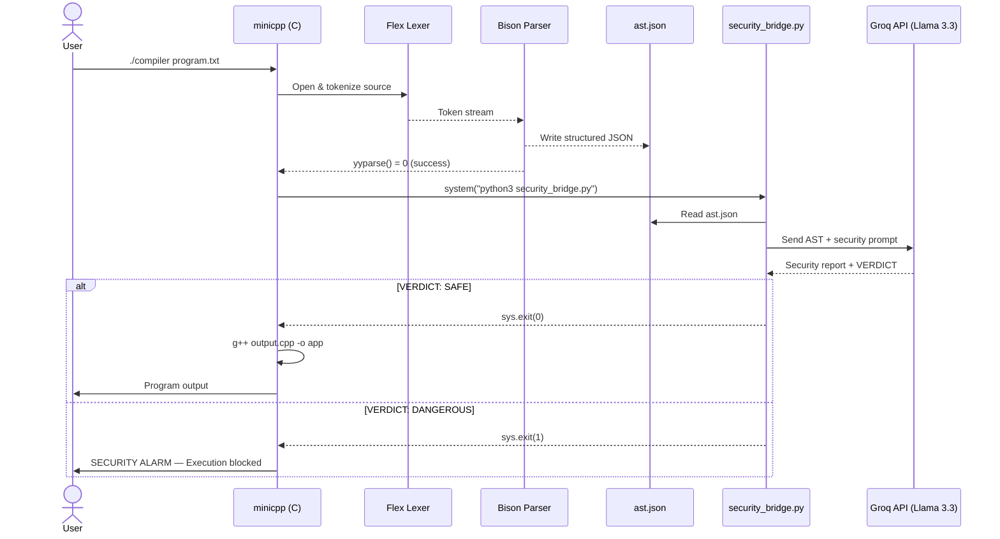

# AgenticAST 

> **An LLM-Driven Framework for Semantic Security in Compiler Design**

AgenticAST is a custom compiler built with Flex and Bison that goes beyond traditional syntax checking. It exports an Abstract Syntax Tree (AST) as JSON and passes it to a Groq-powered AI agent (Llama 3.3-70B) for real-time semantic security analysis — **blocking unsafe code before a single instruction is executed.**

---

##  The Core Idea

Traditional compilers only ask: *"Is the code written correctly?"*

AgenticAST also asks: *"Is the code safe to run?"*

| Layer | Traditional Compiler | AgenticAST |
|---|---|---|
| Syntax Check |  Yes |  Yes |
| Grammar Validation |  Yes |  Yes |
| Semantic / Logic Audit |  No |  Yes (via LLM) |
| Execution Gating |  No |  Yes |

---

##  Project Structure

```
project/
├── lexer.l               # Flex lexer — tokenizes source code
├── parser.y              # Bison parser — grammar + AST/code generation
├── security_bridge.py    # Python bridge — Groq API + LLM security audit
├── program.txt           # Sample input program
├── ast.json              # Generated AST (created at runtime)
├── output.cpp            # Generated C++ code (created at runtime)
└── env/                  # Python virtual environment
```

---

##  System Architecture



---

## 🔄 Pipeline Walkthrough



---

## 🛠️ Tech Stack

| Component | Technology | Role |
|---|---|---|
| Lexical Analysis | **Flex** | Tokenizes raw source code |
| Syntax Analysis | **Bison (LALR-1)** | Validates grammar, builds AST |
| Intermediate Rep | **JSON (ast.json)** | Structured code representation for AI |
| AI Auditor | **Llama 3.3-70B via Groq** | Semantic security analysis |
| Bridge | **Python 3** | Connects compiler to LLM |
| Backend | **g++ (C++17)** | Compiles and runs safe programs |

---

## ⚙️ Installation & Setup

### Prerequisites

- GCC / G++
- Flex & Bison
- Python 3.10+
- A [Groq API Key](https://console.groq.com)


### 1. Set up Python environment

```bash
python3 -m venv env
source env/bin/activate
pip install groq --break-system-packages
```

### 2. Set your Groq API key

```bash
export GROQ_API_KEY='your_groq_api_key_here'
```

To make it permanent, add the line above to your `~/.bashrc` and run `source ~/.bashrc`.

### 3. Build the compiler

```bash
bison -d parser.y
flex lexer.l
gcc parser.tab.c lex.yy.c -o compiler
```

---

## ▶️ Usage

```bash
./compiler program.txt
```

### Example: Safe Program 

**Input (`program.txt`):**
```
name = "Hamza"
age = 22
if (age > 18) {
    print "Adult"
}
```

**Output:**
```
[1] Syntax Check: Passed.
[2] AST Generated: ast.json created.
[3] AI Security Agent: Analyzing logic via Groq...

========================================
AI AGENT REPORT
========================================
The program logic is straightforward with no infinite loops
or malicious operations detected.

VERDICT: SAFE
========================================

[4] Security Check: Passed. Proceeding to execution...

--- Final Program Output ---
Adult
---------------------------
```

### Example: Dangerous Program 

**Input (`program.txt`):**
```
x = 1
while (x > 0) {
    print "running"
}
```

**Output:**
```
[1] Syntax Check: Passed.
[2] AST Generated: ast.json created.
[3] AI Security Agent: Analyzing logic via Groq...

========================================
AI AGENT REPORT
========================================
CRITICAL: The while loop condition (x > 0) will never be false
because x is never modified inside the loop body.
This is an infinite loop.

VERDICT: DANGEROUS
========================================

[!] SECURITY ALARM: Execution blocked by AI Agent.
```

---


##  Supported Language Features

The custom mini-language supports:

- **Variable assignment** with automatic type inference (`auto` in generated C++)
- **Arithmetic expressions** — `+`, `-`, `*`, `/`
- **Comparison operators** — `==`, `<`, `>`
- **Control flow** — `if` / `while` blocks
- **Print statements** — `print <expr>`
- **Data types** — integers, floats, strings, chars

---

##  Research Context

This project bridges two fields:

- **Compiler Construction** — Deterministic parsing using Flex/Bison (LALR-1 grammar)
- **Agentic AI** — Using LLMs as autonomous decision-making agents in a pipeline

The key innovation is the **Semantic Gap**: traditional compilers check *syntax* (form), while AgenticAST also checks *semantics* (meaning and intent) using an LLM.

> *"AgenticAST: A Framework for LLM-Driven Semantic Security in Compiler Construction"*

